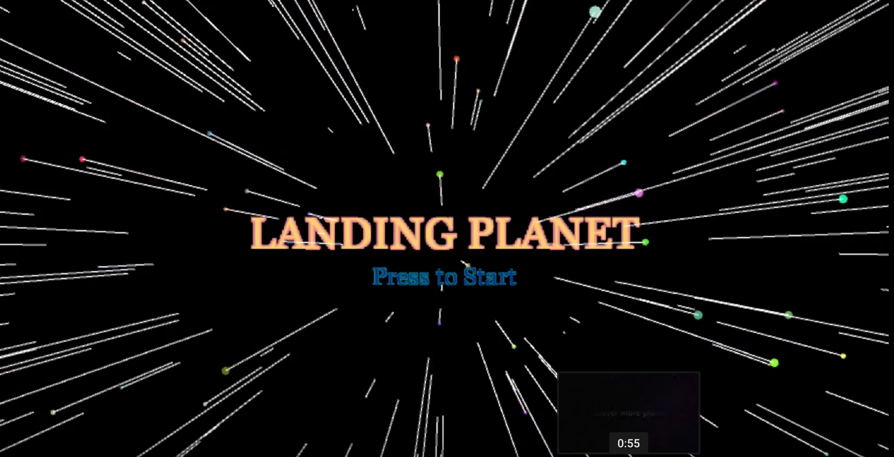
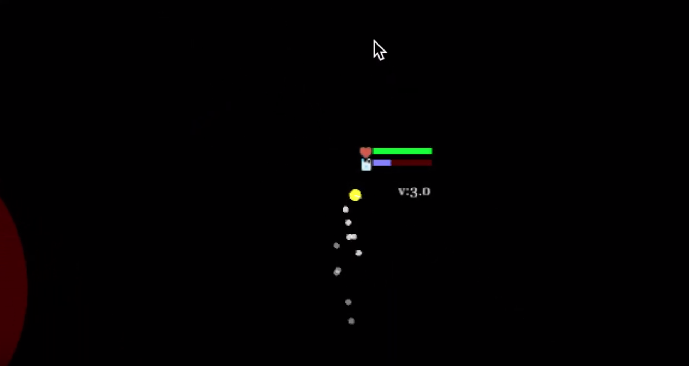
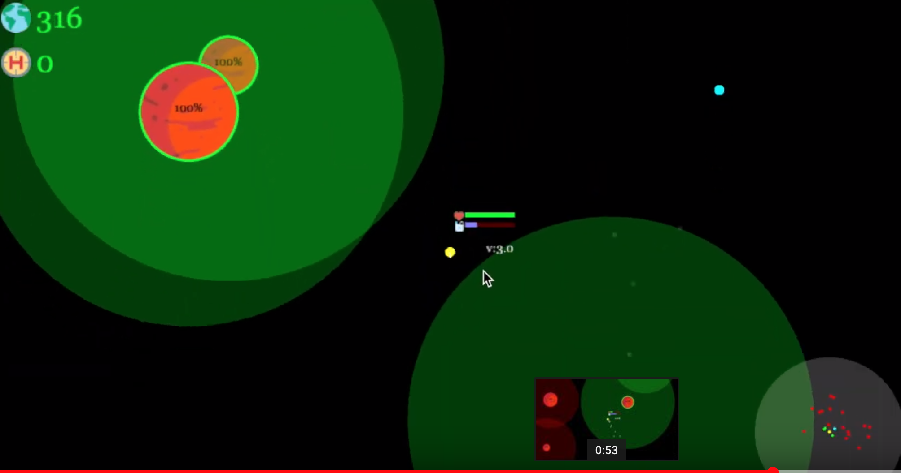

LANDING-PLANET
=====
此專案使用了Java版 Processing開發的一款太空遊戲，並且有Android版本。利用電腦圖學的概念去模擬太空的物理(星球重力、降落及太空重力)，同時也有粒子系統(太空船噴射特效)及降落特效(視角縮放)。

## Video

## How to run
1. clone此專案:`git clone hhttps://github.com/alanhc/LANDING-PLANET.git`
2. 下載 [Processing](https://processing.org/) 執行

## 如何操作:
電腦版:滑鼠點按
手機版:觸控操作
飛船會往中心點及點選方向噴射出燃料移動，每個星球有他的物理模擬(星球重力)，您的任務就是要在燃料用盡前探索夠多的星球。

## 特點:
1. 炫麗的特效
2. 物理(星球重力及降落)及粒子系統(噴射)
3. 世界地圖可根據視角縮放

## 畫面截圖

## GamePlay video

